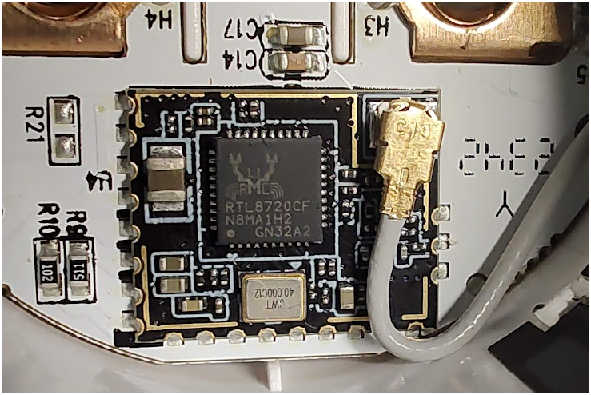
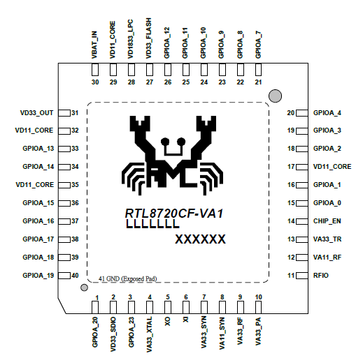

# Trying to flash Tuya (Eightree) smart socket

Device: `eightree smart plug et20`

## Chip!
- 
- 

### Chip details:
- https://docs.libretiny.eu/boards/generic-rtl8720cf-2mb-992k/
- https://www.e-paper-display.com/products_detail/productId%3D529.html
- (probably) https://developer.tuya.com/en/docs/iot/wbr1-module-datasheet
- (or) https://developer.tuya.com/en/docs/iot/wbr3-module-datasheet
- Listed as supported: https://docs.libretiny.eu/docs/status/supported/#tuya-inc
- (probably main topic) https://github.com/libretiny-eu/libretiny/issues/44#issuecomment-1791175300
- (probably) https://github.com/libretiny-eu/libretiny/issues/235
- Datasheet https://cetest02.cn-bj.ufileos.com/100001_2110255103/RTL872xZ2%20IC%20Datasheet.pdf


### Other info:
- https://www.reddit.com/r/homeautomation/comments/17p0fbd/hacking_eightree_smartsocket_to_use_with_esphome/


# Soft

- https://github.com/libretiny-eu/esphome-kickstart/releases/tag/v23.12.15
- https://esphome.io/components/libretiny
- https://upk.libretiny.eu/

Issues:
- https://github.com/esphome/issues/issues/6124


- YAML
[dummy yaml](../../my_proj/eightree_dummy.yaml)


Run:

```shell
# Test and show
esphome config /home/user/projects/ESPhome/my_proj/eightree_dummy.yaml

# Compile and save locally
# Might not work See (probably main topic)
esphome compile /home/user/projects/ESPhome/my_proj/eightree_dummy.yaml
# Work, but it's not really the chip of the current smart socket. 
esphome compile /home/user/projects/ESPhome/my_proj/eightree_dummy_custom.yaml

# Compile and install!
esphome run /home/user/projects/ESPhome/my_proj/eightree_dummy.yaml

esphome clean /home/user/projects/ESPhome/my_proj/eightree_dummy.yaml
```


# Error

Can't compile now with `board: generic-rtl8720cf-2mb-992k`

```log
Compiling .pioenvs/eightreetst/lib8e9/AsyncTCP-esphome/AsyncTCP.cpp.o
Archiving .pioenvs/eightreetst/libdad/libESPAsyncWebServer-esphome.a
Indexing .pioenvs/eightreetst/libdad/libESPAsyncWebServer-esphome.a
Compiling .pioenvs/eightreetst/lib1e3/DNSServer/DNSServer.cpp.o
Compiling .pioenvs/eightreetst/lib52a/libsodium/crypto_aead/chacha20poly1305/sodium/aead_chacha20poly1305.c.o
Compiling .pioenvs/eightreetst/lib52a/libsodium/crypto_core/ed25519/core_ed25519.c.o
In file included from /home/user/.platformio/packages/library-lwip/src/include/lwip/timeouts.h:44,
                 from /home/user/.platformio/packages/library-lwip/src/include/lwip/tcpip.h:45,
                 from /home/user/.platformio/packages/library-lwip/src/include/lwip/priv/tcpip_priv.h:44,
                 from .piolibdeps/eightreetst/AsyncTCP-esphome/src/AsyncTCP.cpp:369:
/home/user/.platformio/packages/library-lwip/src/include/lwip/sys.h:447:7: error: conflicting declaration of 'u32_t sys_now()' with 'C' linkage
  447 | u32_t sys_now(void);
      |       ^~~~~~~
In file included from /home/user/.platformio/packages/library-lwip/src/include/lwip/opt.h:51,
                 from /home/user/.platformio/packages/library-lwip/src/include/lwip/ip_addr.h:40,
                 from .piolibdeps/eightreetst/AsyncTCP-esphome/src/AsyncTCP.h:28,
                 from .piolibdeps/eightreetst/AsyncTCP-esphome/src/AsyncTCP.cpp:24:
/home/user/.platformio/platforms/libretiny/cores/realtek-ambz2/base/config/lwipopts.h:10:22: note: previous declaration with 'C++' linkage
   10 | extern unsigned long sys_now(void);
      |                      ^~~~~~~
Compiling .pioenvs/eightreetst/lib52a/libsodium/crypto_core/ed25519/core_ristretto255.c.o
Compiling .pioenvs/eightreetst/lib52a/libsodium/crypto_core/ed25519/ref10/ed25519_ref10.c.o
Compiling .pioenvs/eightreetst/lib52a/libsodium/crypto_core/salsa/ref/core_salsa_ref.c.o
*** [.pioenvs/eightreetst/lib8e9/AsyncTCP-esphome/AsyncTCP.cpp.o] Error 1
```


# Fixes and workarounds:


- [Other yaml](../../my_proj/eightree_dummy_custom.yaml)


Using hint from: https://github.com/libretiny-eu/libretiny/issues/44#issuecomment-1850732308

```yaml
rtl87xx:
  board: wbr3
  family: rtl8720c
  framework:
    version: 0.0.0
    source: https://github.com/libretiny-eu/libretiny.git#feature/realtek-update
```


Build OK:

```log
RAM:   [          ]   4.8% (used 12713 bytes from 262144 bytes)
Flash: [======    ]  62.7% (used 575541 bytes from 917504 bytes)
Building UF2 OTA image
|-- esphome_2024.9.1_wbr3_rtl8720cf_lt1.5.1.uf2
|-- firmware.uf2
|-- firmware.bin
======================================================================================================================= [SUCCESS] Took 28.03 seconds =======================================================================================================================

*****************************************************************************************************************************************************************************************************************************************************************************
There is a new version 6.1.16 of PlatformIO available.
Please upgrade it via `platformio upgrade` or `python -m pip install -U platformio` command.
Changes: https://docs.platformio.org/en/latest/history.html
*****************************************************************************************************************************************************************************************************************************************************************************

INFO Successfully compiled program.
```